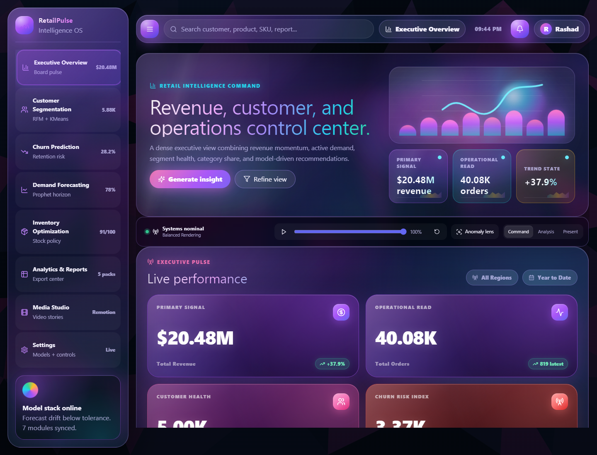
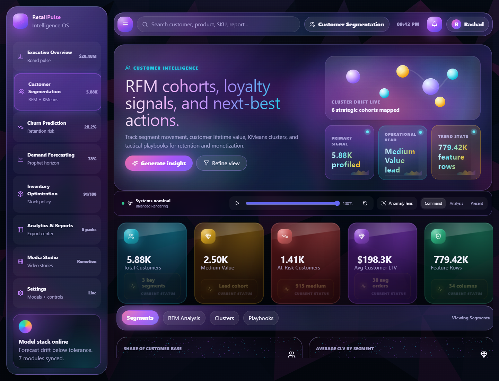
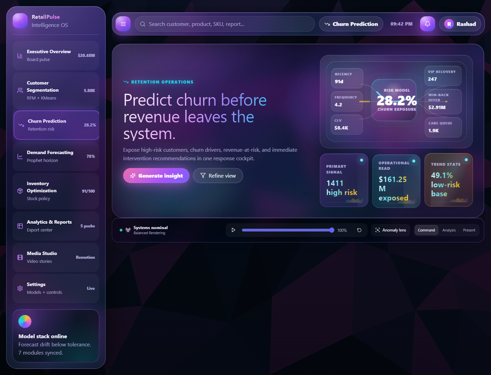
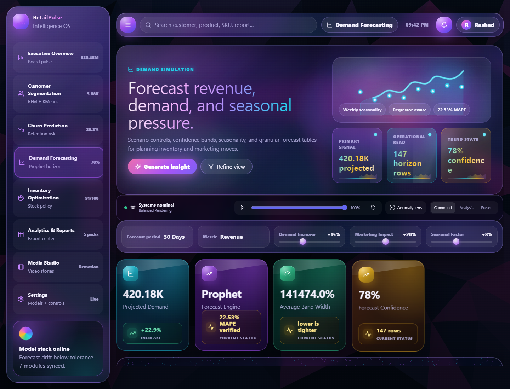
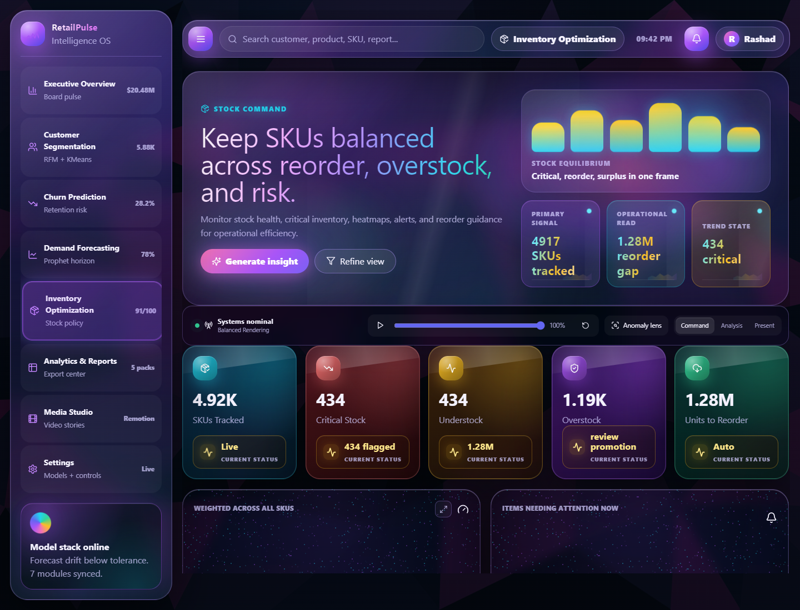
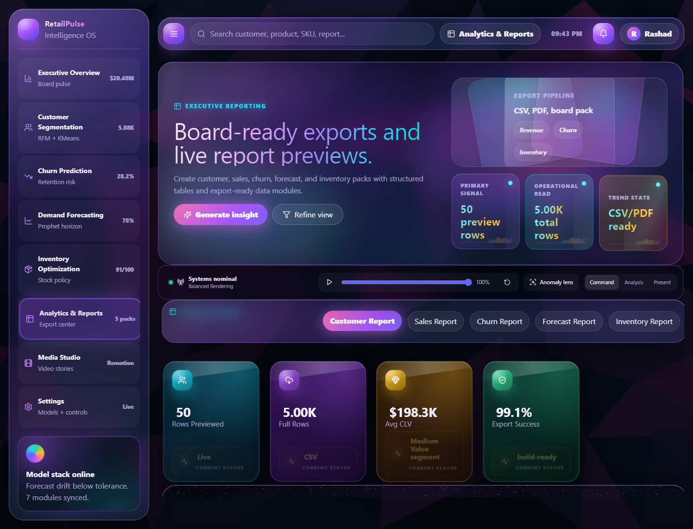
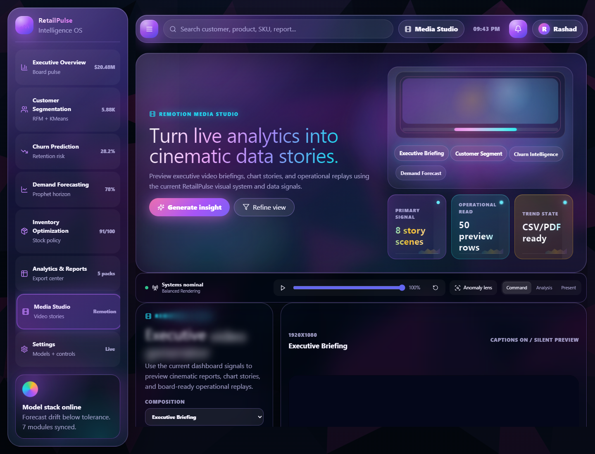
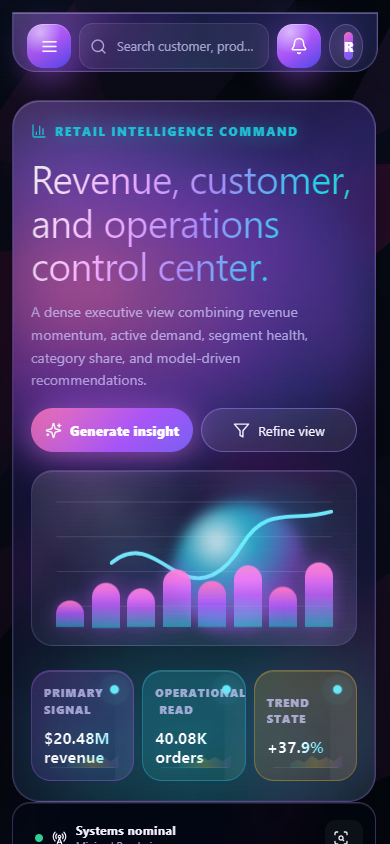

# RetailPulse-Zidio


<p align="center">
  <a href="https://dashboard-rho-pied-52.vercel.app"></a>
  <a href="https://github.com/codeplayboy/RetailPulse-Zidio"></a>
  
  
</p>

## AI-Powered Customer Analytics and Demand Forecasting Platform

RetailPulse-Zidio is a production-style retail intelligence platform built for the Zidio internship project. It connects data engineering, customer intelligence, demand forecasting, inventory optimization, and a premium interactive dashboard into one integrated decision-support system.

The platform converts retail transaction and inventory data into cleaned datasets, engineered features, machine learning outputs, executive KPIs, animated charts, Remotion data stories, and decision-ready business insights.

**Final integrated branch:** `main`  
**Platform integration and dashboard lead:** Rashad Roushan  
**Production dashboard:** [https://dashboard-rho-pied-52.vercel.app](https://dashboard-rho-pied-52.vercel.app)

## Introduction and Dashboard Demo Video

<a href="https://drive.google.com/file/d/12zclOl2Y1PuXtEwLyYUIKh6xQS21I_CK/preview">
  
</a>

**Watch the 19-minute project introduction and dashboard demo:**  
[Open the streaming demo video](https://drive.google.com/file/d/12zclOl2Y1PuXtEwLyYUIKh6xQS21I_CK/preview)

## Project Highlights

- Live React + TypeScript dashboard for executive retail analytics
- Real CSV-driven analytics from team module outputs, not static mock screens
- Integrated data cleaning, feature engineering, segmentation, churn, forecasting, and inventory outputs
- Responsive premium interface for desktop and mobile review
- Remotion-powered Play Data stories connected to dashboard data
- GSAP, Framer Motion, and lightweight 3D-style chart interactions
- Data contract validation script for dashboard integration safety
- Production deployment on Vercel
- Documentation, evidence screenshots, and integration reports included

## Team Members

| Member | Main Responsibility | GitHub / Project Link |
| --- | --- | --- |
| **Rashad Roushan** | **Platform Integration, Dashboard, Deployment, GitHub Management** | [codeplayboy](https://github.com/codeplayboy) |
| Kaviya S | Data Engineering and Dataset Preparation | [feature/kaviya-data-engineering](https://github.com/codeplayboy/RetailPulse-Zidio/tree/feature/kaviya-data-engineering) |
| Rohinee Solunke | Data Cleaning, Feature Engineering, EDA | [feature/rohinee-data-pipeline](https://github.com/codeplayboy/RetailPulse-Zidio/tree/feature/rohinee-data-pipeline) |
| Sachin Yadav | Demand Forecasting, Churn, Inventory ML Outputs | [feature/sachin-forecasting](https://github.com/codeplayboy/RetailPulse-Zidio/tree/feature/sachin-forecasting) |

Note: Rashad's public GitHub profile is verified from the repository owner link. Teammate project branch links are included so their committed work can be reviewed directly. Public teammate profile links can be added when exact usernames are shared.

## Acknowledgement

We sincerely thank Zidio for providing this internship opportunity and giving us the chance to work on a practical, end-to-end AI and analytics project. This project helped us collaborate as a team, practice Git workflows, build machine learning pipelines, integrate real outputs into a dashboard, and prepare a complete deployable product.

## Dashboard Preview

| Executive Overview | Customer Segmentation |
| --- | --- |
|  |  |

| Churn Prediction | Demand Forecasting |
| --- | --- |
|  |  |

| Inventory Optimization | Analytics and Reports |
| --- | --- |
|  |  |

| Media Studio | Mobile Layout |
| --- | --- |
|  |  |

## Problem Statement

Retail businesses often struggle with three connected problems:

- Understanding customer behavior and identifying valuable customer segments
- Forecasting demand accurately enough to support planning decisions
- Maintaining healthy inventory levels without overstocking or stockouts

RetailPulse-Zidio solves these problems by connecting data pipelines, model outputs, and a visual dashboard into one decision-support platform.

## Integrated Modules

### 1. Data Engineering

Owned by Kaviya and supported by Rohinee's processing pipeline.

This module prepares retail data for downstream analytics and machine learning.

Key outputs:

- `data/processed/cleaned_data.csv`
- `data/processed/features_data_sample.csv`
- `data/processed/customer_inventory_enriched.csv`
- `data/processed/dataset_1_daily_revenue_forecasting.csv`
- `data/processed/dataset_2_daily_demand_forecasting.csv`
- `data/processed/dataset_3_sku_level_inventory_forecasting.csv`

### 2. Customer Intelligence

This module creates customer-level behavioral intelligence, including RFM-style features, customer segmentation, churn signals, and retention-focused outputs.

Dashboard coverage:

- Customer segmentation overview
- Segment distribution
- Customer lifetime value ranking
- RFM analysis
- Cluster views
- Retention playbooks

### 3. Demand Forecasting

Owned by Sachin.

The forecasting pipeline uses Prophet-based time series modeling with engineered regressors. Experimental Prophet + LSTM, GRU, CNN-LSTM, residual learning, and ensemble notebooks were also evaluated, but the production Prophet model remained the best verified baseline.

Final production metrics:

| Metric | Value |
| --- | ---: |
| MAE | 5534.49 |
| RMSE | 8759.64 |
| MAPE | 22.53% |

Forecasting limitation:

The demand dataset contains low-demand and zero-demand periods. Since MAPE is percentage-based, zero or near-zero actual demand values increase the error percentage significantly. This limitation is documented as part of the model evaluation context.

Key outputs:

- `outputs/demand_forecast.csv`
- `data/outputs/forecast_metrics.csv`
- `src/forecasting.py`
- `src/prophet_forecasting.py`

### 4. Churn Prediction

The churn module provides customer risk scores, high-risk customer outputs, and retention-focused dashboard views.

Dashboard coverage:

- Churn risk KPIs
- Risk distribution
- High-risk customer table
- Retention recommendations
- Churn Play Data story

Key outputs:

- `outputs/churn_predictions.csv`
- `outputs/high_risk_customers.csv`

### 5. Inventory Optimization

The inventory module calculates stock health and operational recommendations using demand, SKU, and inventory signals.

Dashboard coverage:

- Inventory health gauge
- SKU tracking
- Reorder gap
- Critical stock alerts
- Overstock and understock views
- Inventory recommendations table

Key output:

- `outputs/inventory_recommendations.csv`

### 6. Platform Integration Dashboard

Owned by Rashad Roushan.

The dashboard is the integration layer of the project. It reads processed datasets and model outputs, transforms them into UI-ready metrics, and presents the complete project as an interactive retail intelligence operating system.

Dashboard sections:

- Executive Overview
- Customer Segmentation
- Churn Prediction
- Demand Forecasting
- Inventory Optimization
- Analytics and Reports
- Media Studio
- Settings

Key dashboard files:

- `dashboard/src/App.tsx` - main dashboard shell, navigation, sections, modals, and user flows
- `dashboard/src/data/retailpulse-data.ts` - CSV/JSON loader, integration adapter, KPI derivation, and chart data preparation
- `dashboard/src/chart-animations.tsx` - Remotion Play Data stories and cinematic module previews
- `dashboard/src/App.css` - premium visual system, responsive layout, glassmorphism, chart motion, and mobile polish
- `dashboard/public/data/` - browser-safe data copies used by the live dashboard

## Dashboard Tech Stack

| Area | Technology |
| --- | --- |
| Frontend | React + TypeScript |
| Build Tool | Vite |
| Styling | CSS custom properties, responsive CSS, glassmorphism UI |
| Animation | GSAP, Framer Motion |
| Video/Data Stories | Remotion Player |
| Icons | Lucide React |
| Visual Effects | Lightweight 3D-style chart components |
| Deployment | Vercel |

## Backend and ML Tech Stack

| Area | Technology |
| --- | --- |
| Data Processing | Python, pandas, NumPy |
| ML / Analytics | scikit-learn, Prophet |
| Visualization | Matplotlib, notebook plots |
| Validation | Python validation scripts |
| Notebooks | Jupyter Notebook |

## Repository Structure

```text
RetailPulse-Zidio/
|-- dashboard/                 # React + TypeScript dashboard
|   |-- public/                # Public dashboard assets and data
|   |-- src/                   # App, components, animations, data bindings
|   |-- dist/                  # Production build output
|   |-- package.json
|   `-- vercel.json
|-- data/
|   |-- raw/                   # Raw input data
|   |-- processed/             # Cleaned and feature-engineered data
|   `-- outputs/               # Shared metric outputs
|-- docs/                      # Reports, documentation, screenshots
|   |-- assets/                # README and documentation assets
|   `-- dashboard_evidence/    # Proof screenshots and validation results
|-- models/                    # Model artifacts
|-- notebooks/                 # EDA, forecasting, ML, and experimental notebooks
|-- outputs/                   # Final generated model outputs
|-- src/                       # Reusable Python production modules
|-- tests/                     # Validation and test scripts
|-- tools/                     # Integration validation utilities
|-- README.md
`-- requirements.txt
```

## Data and Output Contracts

The dashboard expects these core files:

```text
data/processed/cleaned_data.csv
data/processed/features_data_sample.csv
data/processed/customer_inventory_enriched.csv
data/processed/dataset_1_daily_revenue_forecasting.csv
data/processed/dataset_2_daily_demand_forecasting.csv
data/processed/dataset_3_sku_level_inventory_forecasting.csv
outputs/demand_forecast.csv
outputs/churn_predictions.csv
outputs/high_risk_customers.csv
outputs/inventory_recommendations.csv
```

The full `features_data.csv` is large and may exceed normal GitHub file size limits. A sample file with the same schema is included for repository-friendly validation and dashboard integration testing.

## Setup Guide

### 1. Clone the Repository

```bash
git clone https://github.com/codeplayboy/RetailPulse-Zidio.git
cd RetailPulse-Zidio
```

### 2. Create a Python Environment

Windows PowerShell:

```powershell
python -m venv venv
venv\Scripts\Activate.ps1
pip install -r requirements.txt
```

macOS / Linux:

```bash
python -m venv venv
source venv/bin/activate
pip install -r requirements.txt
```

If dependency installation fails because of local Prophet setup differences, install the main libraries manually:

```bash
pip install pandas numpy scikit-learn matplotlib prophet joblib
```

### 3. Validate Dashboard Data Inputs

```bash
py -3 tools/dashboard_data_contract_check.py
```

Expected result:

```text
PASS | Revenue source
PASS | Demand source
PASS | SKU inventory source
PASS | Forecast output
PASS | Churn output
PASS | Inventory recommendations
PASS | Feature sample
```

### 4. Install Dashboard Dependencies

```bash
cd dashboard
npm install
```

### 5. Run the Dashboard Locally

Development server:

```bash
npm run dev
```

Production preview:

```bash
npm run build
npm run preview
```

Then open:

```text
http://127.0.0.1:4173/
```

## Testing and Verification

Recommended checks before final submission:

```bash
py -3 tools/dashboard_data_contract_check.py
cd dashboard
npm run build
```

Latest verified dashboard data contract:

```text
PASS | Revenue source | rows=739
PASS | Demand source | rows=739
PASS | SKU inventory source | rows=4917
PASS | Forecast output | rows=147
PASS | Churn output | rows=5000
PASS | Inventory recommendations | rows=4917
PASS | Feature sample | rows=10000
```

Evidence files:

- `docs/dashboard_evidence/dashboard_data_contract_results.json`
- `docs/dashboard_evidence/proof_dashboard_data_contract.png`
- `docs/dashboard_evidence/proof_npm_build.png`
- `docs/RetailPulse_Complete_Dashboard_Integration_Book_Rashad_Roushan.docx`
- `docs/RetailPulse_Dashboard_Integration_Testing_Report_Rashad.docx`

## Deployment

Production deployment:

[https://dashboard-rho-pied-52.vercel.app](https://dashboard-rho-pied-52.vercel.app)

Vercel deployment command from the dashboard folder:

```bash
cd dashboard
npx vercel --prod
```

The project also includes `dashboard/vercel.json` so Vercel serves the Vite dashboard correctly.

## Git Workflow Used

The project used a branch-based workflow:

```text
main
|-- feature/kaviya-data-engineering
|-- feature/rohinee-data-pipeline
|-- feature/sachin-forecasting
`-- feature/rashad-platform-engineering
```

Current repo state:

- `main` is the final integrated branch.
- `origin/HEAD` points to `origin/main`.
- Recent integration commits on `main` were authored by Rashad Roushan.
- Teammate branches remain available for reviewing individual module work.

## Known Limitations

- Forecasting MAPE is affected by zero-demand and low-demand days in the dataset.
- The complete `features_data.csv` is too large for normal GitHub upload without Git LFS or external storage.
- Some advanced visual dashboard elements are optimized for presentation and decision support, while the underlying values are driven by the available CSV outputs.

## Future Scope

- Add an API layer for live database-backed dashboard refreshes
- Add Git LFS or cloud storage for large processed datasets
- Add automated CI checks for dashboard build and data contract validation
- Add scheduled model retraining and drift monitoring
- Expand explainability with model confidence and feature contribution views
- Improve deployment automation for both GitHub Pages and Vercel

## Final Status

RetailPulse-Zidio currently includes:

- Completed data pipeline outputs
- Completed forecasting pipeline and model evaluation
- Completed churn and inventory outputs
- Integrated premium dashboard
- Mobile and desktop responsive layouts
- Data contract verification
- Production Vercel deployment
- Final documentation and dashboard evidence

This repository represents the final integrated project build prepared for presentation and review.
